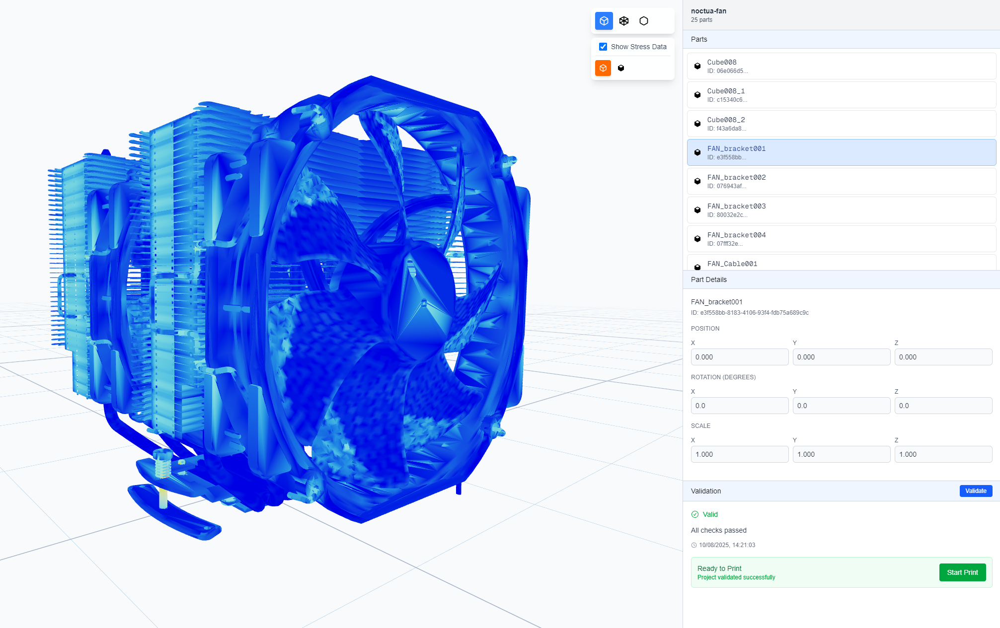

# CAD Model Viewer

A lightweight CAD model viewer built with modern web tools. Designed for easy part inspection, format flexibility, and simulated validation.



## Features

- Load `.stl`, `.obj`, and `.glb` 3D model files
- View parts in a simple outliner panel
- Toggle between shaded and wireframe views
- Perform a dummy "Send to Validation" task

## Tech Stack

- **Next.js** – App framework
- **React** + **TypeScript** – UI logic
- **Tailwind CSS** – Styling
- **ShadCn** – UI components
- **React Three Fiber** – 3D rendering
- **Drei** – Useful helpers for R3F
- **Zustand** – Lightweight global state

---

For demonstration purposes only. No data is uploaded or stored.

This is a [Next.js](https://nextjs.org) project bootstrapped with [`create-next-app`](https://nextjs.org/docs/app/api-reference/cli/create-next-app).

## Getting Started

First, run the development server:

```bash
npm run dev
# or
yarn dev
# or
pnpm dev
# or
bun dev
```

Open [http://localhost:3000](http://localhost:3000) with your browser to see the result.

You can start editing the page by modifying `app/page.tsx`. The page auto-updates as you edit the file.

This project uses [`next/font`](https://nextjs.org/docs/app/building-your-application/optimizing/fonts) to automatically optimize and load [Geist](https://vercel.com/font), a new font family for Vercel.

